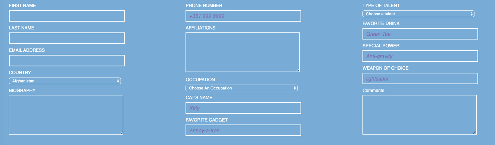

# Form Design 

## Challenges I Faced? 

I lack understanding on CSS grid and it capabilites. As well as how to take input from a user on a form. 

## How Did I Over Come Those Challenges? 

By collaborating with my peers and having conversations with them about their different approaches to this problem I was able to get a general idea of how I could tackle the problem. Once I had a general idea I begin to map out on a whiteboard step-by-step how I was going to implement those solutions. By doing research on platforms like Google,YouTube, MDN docs, stackoverflow, GitHub, online courses, and reference guides. I was able to find the proper CSS techniques in order to finish the task and program the form accordingly. 

## What Did I Learn? 

* HTML
* CSS Layout
* Git Basics
* How to take an input from the user
* How to manipulate placeholder text

